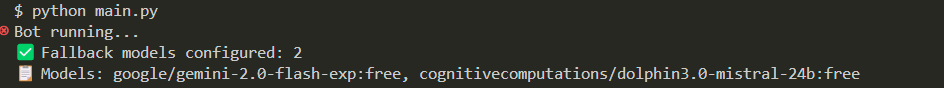
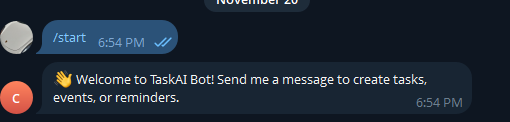
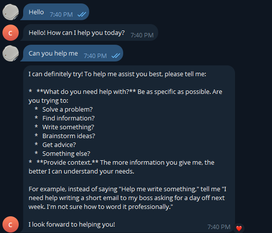
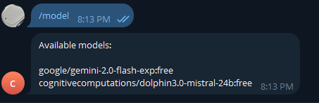

Telegram OpenRouter AI Bot

I created a Telegram AI chatbot powered by OpenRouter that can respond to user messages in real-time. I designed it to automatically handle multiple free AI models, with built-in fallback if a model is rate-limited.

The bot features a clean, unified command system: users can start a conversation, see available models, and interact seamlessly with the AI. I built it using Python and the python-telegram-bot library, showcasing my skills in asynchronous programming, API integration, and bot development.

---

## Setup

1. Clone the repository:

```bash
git clone https://github.com/yourusername/telegram-openrouter-bot.git
cd telegram-openrouter-bot
```


2. Set your environment variables in set_env.sh:

```bash
nano set_env.sh
# Add your BOT_TOKEN and OPENROUTER_API_KEY
```

3. Source the environment variables:

```bash
source set_env.sh
```


4. Install dependencies:

```bash
pip install -r requirements.txt
```

5. Run the Bot

```bash
python main.py
```


# Features

Unified /start and message handler

Automatic model fallback if one is rate-limited

Console logs which model is being used

/models command to see all available AI models

Friendly messages for users when AI is unavailable


# Tech Stack

Python 3.11+

python-telegram-bot v20+

Requests library

OpenRouter AI

## Demo

Welcome message:




AI response:



Models list:


